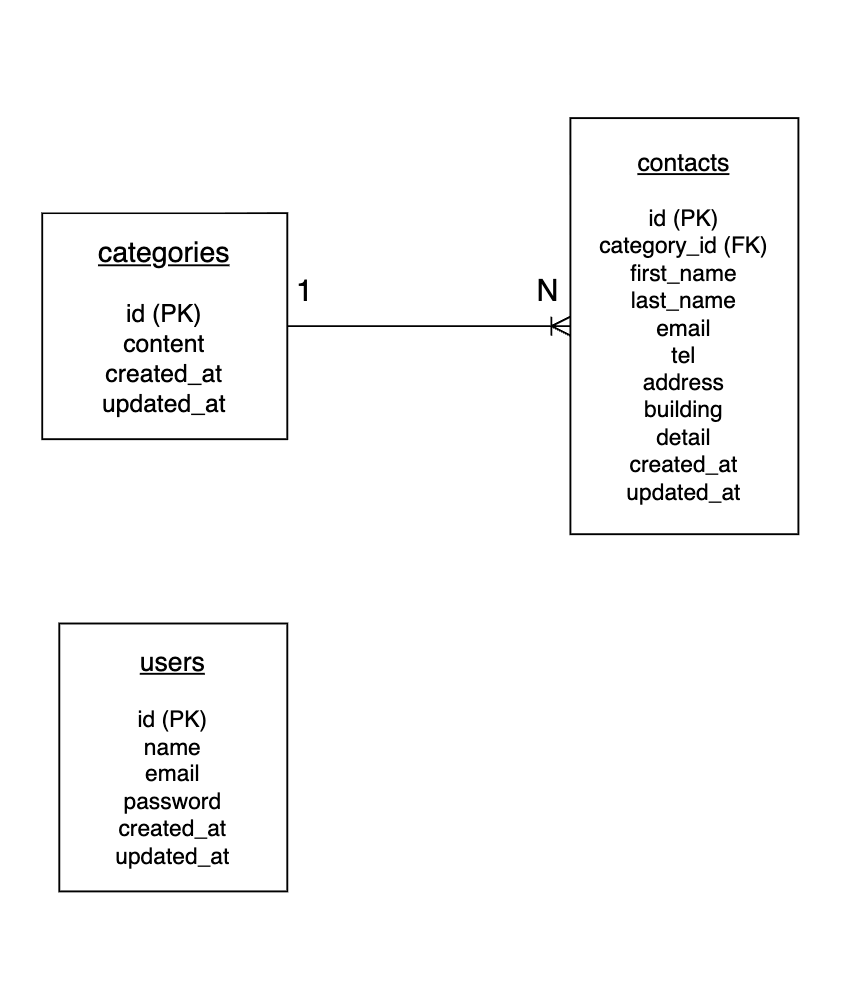

# FashionablyLate （お問い合せフォーム）

## 環境構築

### Dockerビルド
```bash
git clone git@github.com:sachimo0411-ctrl/contact-form-test.git
cd contact-form-test
docker compose up -d --build
```

### Laravel環境構築

```bash
docker compose exec php bash
composer install
cp .env.example .env
```

### Laravelセットアップ

```bash
php artisan key:generate
php artisan migrate
```

## 使用技術
- php 8.1-fpm
- Laravel 10.x
- MySQL 8.0.26
- nginx 1.21.1

## ER図
- 

## 機能一覧
- お問い合せフォーム(入力・確認・送信)
- ログイン / ログアウト / 会員登録
- 管理画面一覧表示
- バリデーション
- 検索機能
- CSVエクスポート

## URL
- お問合せ画面：http://localhost
- ユーザー登録：http://localhost/register
- 管理画面：http://localhost/admin
- phpmyadmin:http://localhost:8080